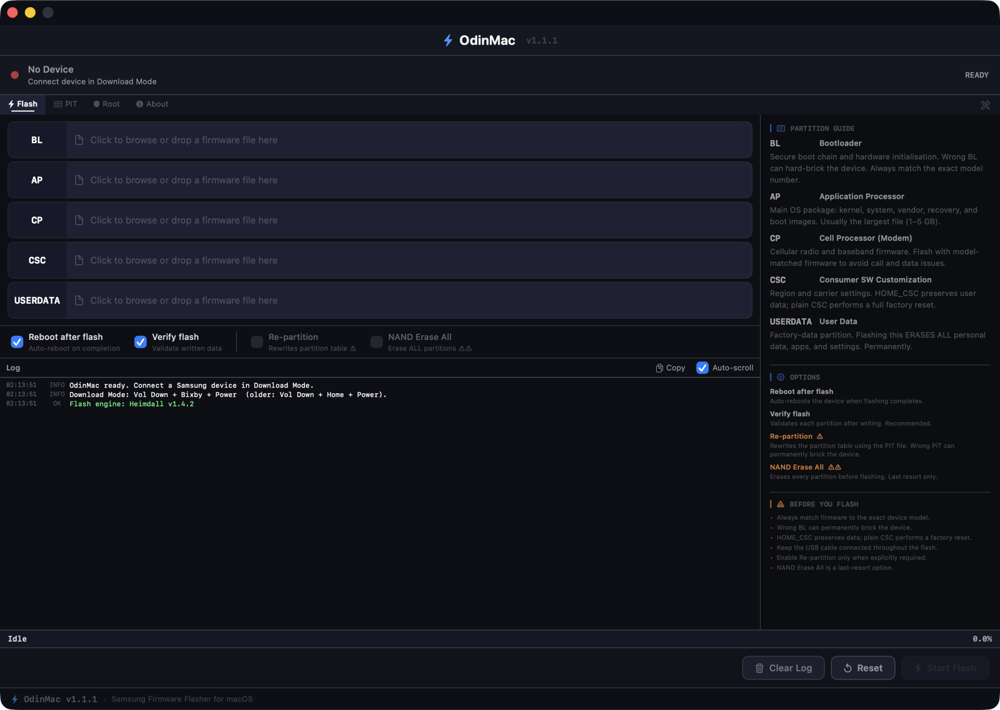

# OdinMac

<p align="center">
  
</p>

<p align="center">
  <strong>A native Samsung firmware flasher for Apple Silicon Macs.</strong><br>
  Flash BL, AP, CP, CSC, HOME_CSC, and USERDATA packages from macOS without
  Windows, a virtual machine, or a kernel extension.
</p>

<p align="center">
  <a href="https://github.com/h4rithd/OdinMac/releases/latest"></a>
  
  
  
  <a href="LICENSE"></a>
</p>



> [!CAUTION]
> Flashing firmware can permanently damage a device or erase its data. Always
> use firmware made for the device's exact model number. You use OdinMac at
> your own risk.

## Overview

OdinMac is an open-source, Odin-style Samsung firmware flashing utility for
macOS. It provides a compact native SwiftUI interface around a bundled,
statically linked build of [Heimdall](https://github.com/Benjamin-Dobell/Heimdall).

OdinMac inspects selected firmware archives, finds a compatible PIT mapping,
prepares images, prevents duplicate partition arguments, and runs one monitored
Heimdall flash session with live logs and progress.

## Features

- Native macOS SwiftUI interface with a fixed, focused workspace.
- Flash Samsung `BL`, `AP`, `CP`, `CSC`, `HOME_CSC`, and `USERDATA` packages.
- Accept `.tar.md5`, `.tar`, `.md5`, `.img`, `.bin`, `.lz4`, and `.mbn` files.
- Browse for files or drag and drop them into partition slots.
- Inspect archive size, format, and contained partition images before flashing.
- Prefer a firmware-supplied PIT for reliable image-to-partition mapping.
- Download and reuse the device PIT when a firmware PIT is unavailable.
- Prevent duplicate partition arguments; later firmware slots safely override
  earlier images that map to the same partition.
- Decompress LZ4 images before flashing and abort safely when `lz4` is missing.
- Show Download Mode connection state, live flash progress, and detailed logs.
- Detect normally booted devices over ADB and read model, Android version, CSC,
  Knox state, and bootloader lock status.
- Provide guarded Re-partition and NAND Erase All options with confirmations.
- Bundle a kext-free Apple Silicon Heimdall engine with static libusb.

### Planned

- Guided Magisk/root workflow in the Root tab.
- Direct boot-image patching and patched-boot flashing from macOS.

## Requirements

| Requirement | Details |
|---|---|
| Mac | Apple Silicon Mac (`arm64`) |
| macOS | macOS 13 Ventura or later |
| Device | Samsung device supported by Heimdall and accessible in Download Mode |
| Cable | Reliable USB data cable connected directly to the Mac |
| Firmware | Firmware matching the device's exact model and region |

Optional tools:

```bash
# Required for most modern .lz4-compressed firmware images
brew install lz4

# Enables ADB device information and future root workflows
brew install android-platform-tools
```

## Download And Install

1. Download the latest ZIP from
   [GitHub Releases](https://github.com/h4rithd/OdinMac/releases/latest).
2. Unzip `OdinMac-v*-macOS-arm64.zip`.
3. Move `OdinMac.app` to `/Applications`.
4. Remove the quarantine attribute because the app is ad-hoc signed and is not
   notarized:

```bash
xattr -dr com.apple.quarantine /Applications/OdinMac.app
open /Applications/OdinMac.app
```

You can alternatively open **System Settings > Privacy & Security** and choose
**Open Anyway** after the first blocked launch.

## Flash Samsung Firmware

1. Back up important data.
2. Download firmware for the device's **exact model number**.
3. Extract the download until you have files such as:

```text
BL_....tar.md5
AP_....tar.md5
CP_....tar.md5
CSC_....tar.md5       # factory reset
HOME_CSC_....tar.md5  # attempts to preserve user data
```

4. Put the phone into Samsung Download Mode.
5. Connect it directly to the Mac with a reliable USB cable.
6. Open OdinMac and wait for **Download Mode - Ready**.
7. Drag each firmware archive into its matching slot.
8. Review the Partition Guide, selected options, and log.
9. Click **Start Flash** and do not disconnect the cable until completion.

### Enter Download Mode

The exact key combination varies by Samsung model:

- Many newer devices: power off, connect USB while holding both volume buttons,
  then confirm the warning screen.
- Devices with Bixby: hold **Volume Down + Bixby + Power**, then confirm.
- Older devices with a Home button: hold **Volume Down + Home + Power**, then
  confirm.

Check the instructions for your exact device before continuing.

## Firmware Slots

| Slot | Purpose | Important notes |
|---|---|---|
| `BL` | Bootloader and secure boot chain | Wrong BL can permanently brick the device |
| `AP` | Main OS, boot, recovery, system, vendor, and related images | Usually the largest archive |
| `CP` | Cellular modem/baseband firmware | Must match the device model |
| `CSC` | Region and carrier customization | Plain CSC normally performs a factory reset |
| `HOME_CSC` | Region and carrier customization | Intended to preserve user data |
| `USERDATA` | Carrier or factory user-data image | Erases personal data when flashed |

## Flash Options

| Option | Behavior |
|---|---|
| **Reboot after flash** | Reboots the device after a successful flash |
| **Verify flash** | Requests validation of written data; recommended |
| **Re-partition** | Writes the selected PIT partition table; only use when explicitly required |
| **NAND Erase All** | Erases every partition before flashing; last-resort operation |

> [!WARNING]
> Never enable **Re-partition** or **NAND Erase All** as routine troubleshooting
> steps. Both options can leave the device unbootable and may cause permanent
> damage when used with incorrect firmware or PIT data.

## How OdinMac Protects The Flash

- Refuses to flash when no selected image can be mapped to a PIT partition.
- Never flashes an LZ4-compressed blob without decompressing it first.
- Removes duplicate partition arguments before invoking Heimdall.
- Checks Heimdall output for parser failures that may otherwise return exit code
  `0`.
- Uses firmware PIT data for mapping without writing the PIT unless
  Re-partition is explicitly enabled.
- Serializes Heimdall access so device detection cannot interrupt an active
  flash.

No flashing tool can protect a device from firmware made for the wrong model.

## Troubleshooting

### OdinMac does not detect the device

- Confirm the device is actually in Samsung Download Mode.
- Try another high-quality USB data cable.
- Connect directly to the Mac instead of through a hub.
- Close other Android/Samsung utilities that may claim the USB device.
- Disconnect the cable, exit Download Mode, re-enter it, and reconnect.

### macOS blocks OdinMac

```bash
xattr -dr com.apple.quarantine /Applications/OdinMac.app
```

The current releases are ad-hoc signed and not notarized.

### OdinMac says `lz4` is missing

```bash
brew install lz4
```

Restart OdinMac after installation.

### PIT download fails

Select the matching `CSC` or `HOME_CSC` archive so OdinMac can use the
firmware-supplied PIT for partition mapping. Also try re-entering Download Mode
and reconnecting the USB cable.

### Flash failed or the device is stuck

Read and copy the complete OdinMac log before closing the app. Do not repeatedly
retry with Re-partition or NAND Erase All. Verify the firmware model, cable,
Download Mode state, and PIT source first.

## Build From Source

Install Xcode Command Line Tools:

```bash
xcode-select --install
```

Clone and build:

```bash
git clone https://github.com/h4rithd/OdinMac.git
cd OdinMac
./build.sh
open OdinMac.app
```

`build.sh` compiles the Swift sources, bundles the vendored Heimdall engine and
app icon, assembles `OdinMac.app`, and ad-hoc signs the result.

Create a release ZIP:

```bash
./scripts/release.sh
```

Rebuild the bundled Heimdall engine from its pinned source commit:

```bash
brew install libusb
./scripts/build-heimdall.sh
```

The rebuild script applies
[`patches/heimdall-use-local-pit.patch`](patches/heimdall-use-local-pit.patch)
and writes the reproducible arm64 binary to `vendor/heimdall/heimdall`.

## Project Structure

```text
OdinMac/
├── Core/                       Flashing, PIT, Heimdall, USB, ADB, and Magisk logic
├── Models/                     Flash configuration, device information, and logs
├── Views/                      SwiftUI application interface
├── Assets.xcassets/            App icon and accent color
├── Info.plist
└── OdinMac.entitlements
patches/                        Patch used by the Heimdall rebuild
scripts/                        Heimdall rebuild and release packaging scripts
vendor/heimdall/                Bundled Heimdall binary and license
build.sh                        Main application build script
```

## Technical Notes

The app does not implement Samsung's Odin protocol itself. Device communication
is delegated to Heimdall through a monitored subprocess.

The flashing pipeline is:

```text
detect device
  -> inspect selected archives
  -> find or download PIT
  -> map images to PIT partitions
  -> decompress images when needed
  -> remove duplicate partition mappings
  -> invoke one Heimdall flash session
  -> stream progress and logs
```

## Contributing

Issues and pull requests are welcome. When reporting a flashing problem, include:

- Mac model and macOS version.
- Samsung model number.
- Whether OdinMac detected Download Mode.
- Firmware slot names without sharing personal data.
- Complete OdinMac log with serial numbers or personal paths redacted.

Do not upload proprietary Samsung firmware or personal device data to issues.

## License And Credits

OdinMac is available under the [MIT License](LICENSE).

OdinMac bundles a modified, statically linked build of
[Heimdall](https://github.com/Benjamin-Dobell/Heimdall), licensed under the MIT
License. See [`vendor/heimdall/LICENSE`](vendor/heimdall/LICENSE) for details.

OdinMac is not affiliated with, endorsed by, or sponsored by Samsung Electronics.
Samsung, Odin, Android, and Magisk may be trademarks of their respective owners.
